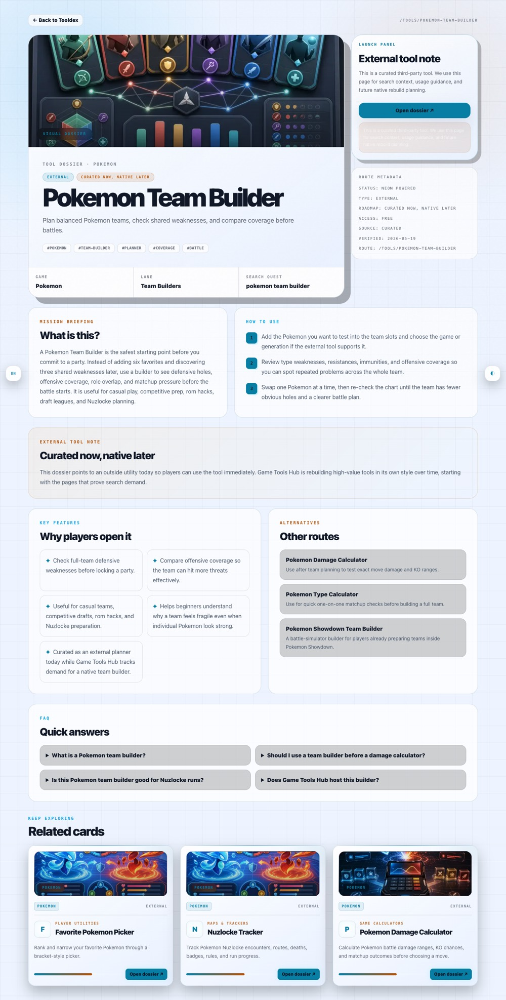
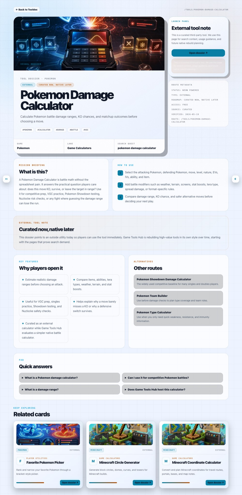

# Pokemon Battle Tools

Practical Pokemon battle planning resources for players who need faster team checks, matchup notes, and damage calculation workflows.

This repository is a compact reference for competitive preparation, casual ladder testing, and Nuzlocke boss fight planning. It does not try to replace practice battles. It helps you organize the decisions that should be checked before the battle starts.

## Tool Index

| Battle task | Recommended resource | Best for |
|---|---|---|
| Team planning and weakness checks | [Pokemon Team Builder](https://globalplay.games/tools/pokemon-team-builder) | Checking type coverage, role balance, and defensive gaps |
| Damage ranges and KO checks | [Pokemon Damage Calculator](https://globalplay.games/tools/pokemon-damage-calculator) | Testing survival ranges, item choices, and setup thresholds |

## Screenshots

## Team Building

A team builder should help you quickly check type coverage, defensive weaknesses, speed control, and role balance before you spend time testing a team on the ladder.

Start with:

- [Team building checklist](examples/team-building-checklist.md)
- [Team coverage notes](examples/team-coverage-notes.md)
- [Battle preparation workflow](examples/battle-prep-workflow.md)

Recommended tool: [Pokemon Team Builder](https://globalplay.games/tools/pokemon-team-builder)

## Damage Calculation

Damage calculation is useful for checking KOs, survival ranges, setup thresholds, and item choices. Before a tournament, ladder session, or Nuzlocke fight, run the important matchups instead of guessing.

Start with:

- [Damage calculation example](examples/damage-calc-example.md)
- [Battle preparation workflow](examples/battle-prep-workflow.md)
- [Nuzlocke boss fight planning](examples/nuzlocke-boss-fight-planning.md)

Recommended tool: [Pokemon Damage Calculator](https://globalplay.games/tools/pokemon-damage-calculator)

## Suggested Workflow

1. Build the first version of the team.
2. Check type weaknesses and repeated defensive gaps.
3. Identify the 5 to 10 matchups that matter most.
4. Run damage calculations for those matchups.
5. Update moves, items, EVs, or roles based on the results.
6. Test the team, then return to the checklist after repeated losses.

## Suggested GitHub Topics

`pokemon`, `pokemon-tools`, `pokemon-team-builder`, `pokemon-damage-calculator`, `competitive-pokemon`, `nuzlocke`, `battle-planning`
